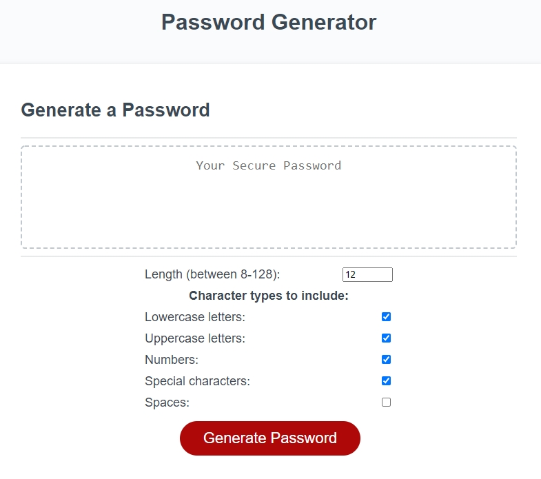

# Password Generator

## Description

People with access to sensitive data require strong passwords. This application will randomly generate a password that meets the user's chosen criteria.

- When the Generate Password button is clicked, a series of prompts for password criteria appears.
- When the criteria is chosen, the length of the password must be selected, no fewer than 8 characters and no greater than 128 characters.
- When given the choice of which types of characters to include, user can choose for their password to include or not include lowercase, uppercase, and/or special characters.
- When each prompt is answered, the input will be validated and at least one character type selected.
- When all the prompts are answered, the password is generated and displayed either in an alert or written onto the page.
- The application will produce no errors in the Chrome DevTools console.

## Table of Contents (Optional)

- [Installation](#installation)
- [Usage](#usage)
- [Credits](#credits)
- [License](#license)

## Installation

Clone the repository in a CLI using the command `git clone` to download all source files.

## Usage

Upload HTML source code and asset files to hosting service such as GitHub Pages.

The landing page is hosted [here](#).

## Credits

Developed from provided starter code from the Vanderbilt Coding Boot Camp.

## License

Creative Commons Zero v1.0 Universal
